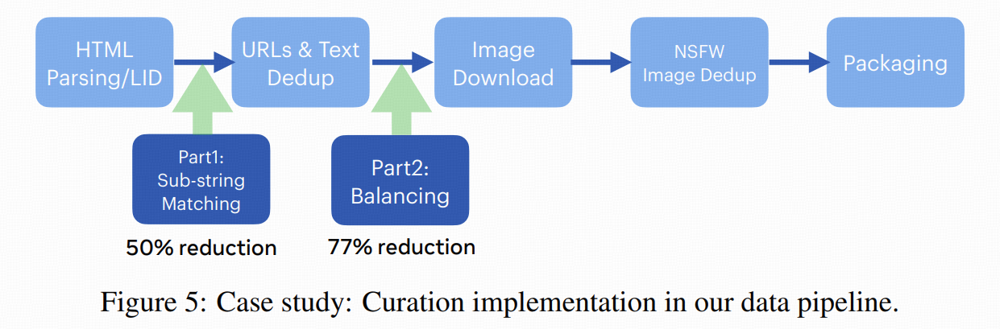

- collapsed:: true
  
  Selection via Proxy: Efficient Data Selection for Deep Learning
	- https://arxiv.org/pdf/1906.11829
	- https://github.com/stanford-futuredata/selection-via-proxy/
	- https://zhuanlan.zhihu.com/p/146482703
	- 核心思想
		- 主要研究了如何通过使用小的代理模型来提高深度学习中数据选择方法（如主动学习和核心集选择）的计算效率。
	- 数据选择方法
		- 主动学习(active learning)
			- 主动学习通过在大量未标记数据中选择点进行标记，基于模型的不确定性或其他启发式方法来选择额外的示例进行标记。
		- 核心集选择(core-set selection)
			- 核心集选择技术则是从大型标记或未标记数据集中找到一个小的子集，该子集能够准确地近似整个数据集。
	- 方法
		- 使用一种规模较小、精度较差的模型作为规模较大目标模型的低代价的代理，并用此来选择用于训练的“核心”数据。尽管这些代理模型准确性较低，但它们选择的是不会对最终模型的准确性产生较大影响（通常在0.1％以内）的高质量数据。另外，在不影响ResNet-164模型准确性的情况下，上述代理模型可以清洗掉50％以上的CIFAR-10训练数据，从而使端到端模型的训练速度提升40％。
		- **选择通过代理（SVP）**：论文提出了一种名为“选择通过代理”（SVP）的方法，通过使用一个小的、计算成本较低的代理模型来执行数据选择，而不是使用目标模型。具体来说，通过移除目标模型的隐藏层、使用更小的架构以及减少训练周期来创建这些代理模型，这些代理模型的训练速度比目标模型快一个数量级。
		- **实验设计**：作者在五个数据集上评估了SVP方法，包括CIFAR10、CIFAR100、ImageNet、Amazon Review Polarity和Amazon Review Full。对于主动学习，SVP在数据选择运行时间上比传统方法快一个数量级，而最终误差几乎没有增加（通常在0.1%以内）。对于核心集选择，SVP能够在不损害目标模型最终准确率的情况下，移除高达50%的数据，从而将端到端训练时间提高了1.6倍。
	- 从宏观上来看，数据选择方法中的迭代过程包括以下三个步骤：
		- 根据一些信息的度量（例如：熵）对样本进行排序；
		- 选择排名最高的样本；
		- 根据选定的样本更新模型。
		- 其中第三步是深度学习的主要瓶颈。模型需要花费数小时甚至数天的时间进行训练，因此对于我们选择的每个样本，从头开始训练模型都不划算。在SVP背后我们核心见解是，虽然较大的模型更准确，但它们排序并且选择相似样本的能力跟规模更小、准确率更低的模型一样。
- collapsed:: true
  
  Demystifying CLIP Data
	- https://arxiv.org/pdf/2309.16671
	- https://github.com/facebookresearch/MetaCLIP
	- https://zhuanlan.zhihu.com/p/661800351
	- 
	- 背景知识
		- **CLIP模型的重要性**：CLIP作为一种对比语言-图像预训练模型，在计算机视觉领域取得了显著的研究进展和应用成果，推动了现代识别系统和生成模型的发展。
		- **CLIP数据的神秘性**：尽管CLIP模型广受欢迎，但其数据策展过程的具体细节却鲜为人知，这促使研究者们尝试通过过滤模型参数来复制CLIP的数据。
	- 研究方法
		- **MetaCLIP方法**：论文提出了MetaCLIP方法，旨在揭示CLIP的数据策展方法，并使其对社区开放。MetaCLIP通过原始数据池和元数据（源自CLIP的概念）生成一个在元数据分布上平衡的子集。
			- 具体来说，MetaCLIP方法通过以下步骤实现数据策展：
				- **元数据构建**：从WordNet和维基百科中提取50万个视觉概念（visual concept），构建元数据。
				- **子字符串匹配**：将原始数据池中的文本与元数据进行匹配，筛选出包含元数据条目的高质量文本。
				- **倒排索引**：为每个元数据条目创建一个倒排索引，将相关的文本聚合起来。
				- **查询和平衡**：对每个元数据条目的匹配文本数量进行限制（例如，t=20k），以平衡数据分布，减少头部条目的主导地位和噪声，同时增加尾部条目的多样性
		- **实验设计**：研究者们通过严格的实验隔离模型和训练设置，专注于数据本身的影响。实验在CommonCrawl数据集上进行，包含4亿图像-文本数据对，MetaCLIP在多个标准基准测试中超越了CLIP的数据表现。
	- 实验结果
		- **零样本ImageNet分类**：在零样本ImageNet分类中，MetaCLIP使用ViT-B模型达到了70.8%的准确率，超过了CLIP的68.3%。当数据规模扩大到10亿时，准确率进一步提高到72.4%。
		- **不同模型尺寸的表现**：MetaCLIP在不同尺寸的模型上都表现出色，例如ViT-H模型在没有使用任何外部数据、模型或更长时间训练的情况下，达到了80.5%的准确率。
	- 关键结论
		- **数据策展的重要性**：论文强调了数据策展过程对于CLIP模型成功的重要性，指出CLIP的优势在于其高质量的WIT400M数据集，该数据集从网络上精心策划而来。
		- **MetaCLIP的透明度和可访问性**：MetaCLIP方法通过提供元数据构建、子字符串匹配、倒排索引以及查询和平衡等详细步骤，使得CLIP的数据策展过程更加透明和易于访问。
		- **性能提升**：MetaCLIP在多个标准基准测试中超越了CLIP的性能，证明了其在数据策展方面的有效性。
	- 其他重要观点
		- **数据分布的平衡**：MetaCLIP通过限制每个元数据条目的匹配文本数量（例如，t=20k），平衡了数据分布，减少了头部条目的主导地位和噪声，同时增加了尾部条目的多样性。
		- **独立采样算法**：论文提出了一种独立采样算法，用于平衡过程，避免了构建昂贵的倒排索引，提高了效率和可扩展性。
		- **数据策展的可扩展性**：MetaCLIP方法可以轻松适应不同的数据池，允许各方完全拥有自己的数据管道，而不依赖于外部提供商的黑盒过滤器。
	- 实验细节
		- **数据池**：
			- 研究者们收集了两个数据池，第一个包含16亿图像-文本对，用于估计4亿图像-文本对的目标；
			- 第二个数据池旨在扩展数据策展流程，包含107亿匹配的图像-文本对。
		- **训练设置**：
			- 严格遵循CLIP的训练设置，使用V100 32GB GPU和相当于32768的全局批量大小。对于ViT-B/32和ViT-B/16，使用64个GPU，每个GPU的批量大小为512；对于ViT-L/14，使用128个GPU，每个GPU的批量大小为256。训练ViT-B/32需要4天，而训练ViT-L/14需要一个月。
	- 附录内容
		- **额外结果**：附录提供了MetaCLIP在DataComp-12.8B数据池上的应用结果，显示了在不同模型尺寸下，MetaCLIP在400M数据和1B数据上的表现。
		- **高效策展的细节**：讨论了如何将策展算法集成到数据管道中，以及如何在数据加载时调整数据分布。
		- **人类研究**：通过人类评估研究了MetaCLIP策展对数据分布的影响，包括噪声减少、视觉内容对齐和任务无关属性。
		- **训练设置差异**：列出了OpenAI CLIP与OpenCLIP在LAION-400M和DataComp 1B上的训练设置差异。
		- **基准去重**：描述了如何使用64位PCA哈希从基准/ImageNet数据中去重。
		- **从CLIP策展中学到的负面结果**：讨论了一些接近CLIP策展但效果不佳的方法，如自策展元数据、大小写敏感的WordNet和停止词/无用条目的移除。
		- **定性数据示例**：提供了在子字符串匹配和平衡之前/之后的数据示例，以及包含ImageNet尾部类别的匹配文本示例。
		  
		  <!--EndFragment-->
- **SemDeDup: DataEfficient Learning at Web-Scale through Semantic Deduplication**
	- https://arxiv.org/pdf/2303.09540
	- 核心思想
		- 通过利用预训练模型的嵌入来识别和移除语义相似但不完全相同的“语义重复”数据对。
	- 背景知识
		- **大规模数据集的重要性**：机器学习的进步在很大程度上得益于数据量的大幅增加。然而，像LAION这样的大规模网络数据集除了搜索精确副本外，几乎没有进行过滤，可能存在大量冗余。
		- **数据效率的挑战**：尽管数据量不断增加，但测试误差通常随着数据量的增加而呈幂律下降，这意味着需要越来越多的数据来实现越来越小的性能提升。因此，提高数据效率，要么使模型在相同时间内达到相同性能，要么在相同计算预算下实现更好的性能，是非常重要的。
	- collapsed:: true
	  
	  Perceptual duplicates
		- Loosely define such data pairs to be perceptually identical to a typical human observer
		- exact duplicates at the pixel or token level that could easily be found via exact duplicate detection in input space.
		- 知觉重复：我们松散地定义这样的数据对在感知上与典型的人类观察者相同。最直接的版本将是像素或token级别的精确重复，这可以通过输入空间的精确重复检测轻松找到。然而，这种方法可能会错过具有人类难以察觉的像素级失真的图像对。大多数广泛使用的数据集已经应用了一些精确的重复过滤器，尽管具有轻微像素级差异的感知重复可以通过这样的过滤器。
	- collapsed:: true
	  
	  Semantic duplicates
		- these are examples which contain largely identical information content, but remain perceptually distinct. For example, a pair of image views which are derived from the same image, but feature different margins, aspect ratios, color distributions, etc. could be considered semantic duplicates. A pair of sentences with the same structure but some words exchanged for synonyms would also be considered a semantic duplicate. Such pairs would rarely, if ever, be detected by exact duplicate filters as they would be far apart in pixel/token space.
		- 语义重复：这些是包含基本相同信息内容的示例，但在感知上仍然不同。例如，来自同一图像的一对图像视图，但特征不同的边距、纵横比、颜色分布等可以被认为是语义重复项。一对结构相同但交换同义词的某些单词的句子也将被视为语义重复。这样的对很少（如果有的话）由精确的重复过滤器检测到，因为它们在像素/标记空间中相距很远。
	- collapsed:: true
	  
	  Semantically redundant data
		- in contrast to semantic duplicates, semantically redundant data are not derived from the same underlying objects and would be clearly distinguishable to a human. However, the information contained in such examples may still contain substantial overlap. For example, consider the case of two different images of two different golden retrievers in two different parks. These images are neither perceptually nor semantically identical as the content of the images differs. However, the information contained in them is quite similar, leading us to think of such pairs as semantically redundant. Each additional semantically redundant data point will provide less and less new information, eventually converging to near-zero information gained from additional such data. Methods such as SSL Prototypes [13] and memorization [15] search for semantically non-redundant data subsets to train on.
		- 语义冗余数据：与语义重复相比，语义冗余数据不是来自同一个底层对象，并且显然可以与人类区分开来。但是，此类示例中包含的信息可能仍然包含大量重叠。例如，考虑两个不同公园中两个不同黄金检索器的图像的情况。这些图像在感知上也不在语义上与图像的内容不同。但是，它们中包含的信息是非常相似的，导致我们认为这样的对在语义上是多余的。每个额外的语义冗余数据点将提供更少和更少的新信息，最终收敛到从其他此类数据中获得的接近零信息。SSL Prototypes [13] 和记忆 [15] 等方法搜索语义非冗余数据子集进行训练。
	- collapsed:: true
	  
	  Misleading data
		- these are data which rather than providing zero information (as in the previous categories) provide negative or harmful signal, in the sense that removing these data actually improves performance, rather than having a neutral effect. While such data are easy to conceive of in supervised learning (i.e. mislabeled examples), it is much less clear what such examples may be in the context of self-supervised learning.
		- 误导性数据：这些是数据，而不是提供零信息（如前几类）提供负面或有害的信号，因为删除这些数据实际上可以提高性能，而不是具有中性效应。虽然此类数据很容易在监督学习中构思（即错误标记的示例），但尚不清楚此类示例在自我监督学习的背景下可能是什么。
	- **方法：**
		- SemDeDup首先使用预训练的基础模型对数据点进行嵌入，然后通过k均值聚类将嵌入空间分割成多个簇。
		- 在每个簇内，计算所有数据点对的余弦相似度，并设置一个阈值来确定哪些数据对是语义重复的。
		- 从每个语义重复的数据对组中，保留与簇中心余弦相似度最低的图像，并移除其余数据。
	- **局限性：**
		- SemDeDup虽然在移除语义重复数据方面表现良好，但它只是减少信息量数据点的一种方式，并没有涵盖所有方面的语义冗余，也没有解决错误或误导性数据的移除问题。
		- SemDeDup需要访问与领域相关的预训练嵌入模型，这可能对完全新颖的领域构成问题。
- **D4: Improving ****LLM**** Pretraining via Document De-Duplication and Diversification**
	- https://arxiv.org/pdf/2308.12284
	- https://proceedings.neurips.cc/paper_files/paper/2023/file/a8f8cbd7f7a5fb2c837e578c75e5b615-Paper-Datasets_and_Benchmarks.pdf
	- https://zhuanlan.zhihu.com/p/656831068
	- D4
		- 结合了文档去重（利用预训练模型的嵌入空间识别语义相似但不相同的数据对）和数据多样化（通过预训练模型的嵌入来选择数据）
- LESS: Selecting Influential Data for Targeted Instruction Tuning
	- https://arxiv.org/pdf/2402.04333
	- “针对性指导调整”（targeted instruction tuning）
	- 挑战在于如何从庞大的数据集中识别出与这些特定能力最相关的数据。
	- LESS（Low-rank gradiEnt Similarity Search）的算法
	- https://zhuanlan.zhihu.com/p/691190579
	- 利用模型的梯度信息来估计数据点对于目标任务的影响
- Data Selection via Optimal Control for Language Models
	- https://arxiv.org/pdf/2410.07064
	- https://github.com/microsoft/LMOps/tree/main/data_selection
	- 将数据选择问题形式化为一个广义的最优控制问题，并使用Pontryagin's Maximum Principle（PMP）来求解，得到了一组描述最优数据选择与LM训练动态之间关系的必要条件。
	- PDS框架的核心思想是将数据选择视为控制变量（即是否将某个数据点包含在预训练中），将LM预训练过程视为动态系统，并将LM的下游性能视为目标。PDS首先在代理数据集上求解最优数据选择，为每个实例分配一个基于其对下游任务影响的质量分数。然后，训练一个小型的语言模型（称为数据评分器）来预测这些质量分数，并在目标语料库上推断分数。最后，根据预测的分数选择实例，形成用于从头开始预训练各种大小LMs的高质量语料库。
	- https://blog.csdn.net/LIUMAO99/article/details/141352702
	  
	  
- **MiniPLM: Knowledge Distillation for Pre-Training Language Models.**
	- https://arxiv.org/pdf/2410.17215
	- https://blog.csdn.net/weixin_36829761/article/details/143240984
	- 大模型要怎么继承小模型的能力：包括知识蒸馏与参数复用的方法
	- 模型训练难度，能力增强不要出现退化；对能力分块训练，不同部分不同增量模型，底模共用
	- 差异采样
	- MINIPLM的基本操作是离线进行大模型的推理，从而避免了训练时不断调用大模型。其独特之处在于差异采样：与其让小模型去模仿大模型的每一步，不如让小模型专注于那些它本来不太擅长的部分——即大模型认为重要但小模型尚未掌握的内容。具体来说，差异采样会根据大模型和一个小参考模型之间输出概率的差异来调整训练数据的分布：
		- 上采样困难样本——这些是大模型处理得很好，但小模型处理得不好的样本。
		- 下采样简单样本——这些是小模型和大模型都能轻松解决的样本。
		- 过滤掉噪声和无用的样本——这些是大模型认为不太有用的内容。
- CiT: Curation in Training for Effective Vision-Language Data
	- https://openaccess.thecvf.com/content/ICCV2023/papers/Xu_CiT_Curation_in_Training_for_Effective_Vision-Language_Data_ICCV_2023_paper.pdf
	- [https://arxiv.org/pdf/2301.02241](https://arxiv.org/pdf/2301.02241)
	- https://blog.csdn.net/qq_45978862/article/details/131583366
	- https://github.com/facebookresearch/CiT
	- 大型视觉语言模型通常适用于许多下游任务，但其高昂的训练成本只有大型机构才能承担。本文以通用性换取效率，提出了训练中的Curation（CiT），这是一种简单高效的视觉文本学习算法，将数据目标与训练相结合。CiT自动生成高质量的数据，以加速对比图像文本训练，并减轻对离线数据过滤管道的需求，允许广泛的数据源（包括来自网络的原始图像文本对）。CiT包含两个循环：一个管理训练数据的外循环和一个使用管理的训练数据的内循环。文本编码器连接两个循环。给定感兴趣任务的元数据，例如类名和大量图像-文本对，CiT通过测量其文本嵌入和元数据嵌入的相似性，从池中选择相关的训练数据。在我们的实验中，我们观察到CiT可以将训练速度提高一个数量级以上，特别是在原始数据量较大的情况下。
	- CiT包含两个循环：外部循环用于策划训练数据，内部循环用于使用策划的数据进行训练。文本编码器连接这两个循环。
- A Survey of Multimodal Large Language Model from A Data-centric Perspective
	- [https://arxiv.org/pdf/2405.16640v2](https://arxiv.org/pdf/2405.16640v2)
	  
	  
	  
	  
	- Active Learning-Based Selection
		- CiT
	- Selection Before Training
	- Distribution-Agnostic Selection
		- 不考虑数据分布的具体特征，而只是基于通用的启发规则或简单的统计方法
	- Distribution-Aware Selection
		- 考虑数据分布的特征
- Effective pruning of web-scale datasets based on complexity of concept clusters
	- https://arxiv.org/pdf/2401.04578
	- 密度基础剪枝
- 用一个比预训练模型架构更小的模型来做去重和多样化的操作
- 观察梯度变化，考虑可能可以造成更大梯度降低的数据
- 数据细粒度的调度问题
	- 学习数据调度策略：元学习旨在让模型学会学习，将数据调度也作为一种可学习的策略。可以设计一个元学习器，它以模型在当前训练批次中的性能指标（如准确率、损失等）和数据的特征（如模态、复杂度、类别等）作为输入，输出下一个批次的数据调度方案。例如，元学习器通过观察模型在不同模态数据训练后的性能变化，学习到对于一个特定的多模态任务，在模型准确率达到某个阈值后，应该如何调整不同模态数据的比例。这种方式使得数据调度能够根据模型的实际学习情况和数据本身的特性进行动态优化。
	- 顺序依赖调度：一旦确定了数据之间的顺序依赖关系，如在文本叙述中的事件先后顺序或者视频帧的时间顺序，就可以按照这种顺序来调度数据输入模型。对于具有因果关系的数据，先输入原因相关的数据，让模型学习到这种因果关联的模式，再输入结果相关的数据进行验证和强化学习。例如，在一个描述化学实验过程的文本 - 图像多模态数据集里，先让模型学习实验步骤的文本描述和对应的初始实验装置图像，然后再输入后续反应过程和结果的图像与文本，这样有助于模型更好地理解整个实验流程的逻辑。
	- 关联强度调度：根据数据之间依赖关系的强度来分配数据的输入权重和频率。通过计算依赖关系图中节点（数据单元）之间连接的权重，来衡量数据之间的关联强度。例如，在一个产品评论的文本数据集中，如果某两个句子之间存在很强的解释和被解释关系，那么在调度数据时，可以将这两个句子作为一组经常一起输入模型，并且在模型训练过程中，给予这组数据更高的重要性权重，使模型更加关注这种强关联的数据对，从而更好地理解评论中的关键信息。
	- 动态更新依赖关系调度：数据之间的依赖关系可能会随着模型的学习过程而发生变化。例如，在模型初期，可能更关注简单的实体 - 描述关系，但随着训练的深入，会开始理解更复杂的概念 - 解释关系。因此，需要动态地更新数据依赖关系图，并根据新的关系来调整数据调度策略。这可以通过定期重新评估数据之间的语义、时间或空间关系来实现，或者根据模型在验证集上对不同关系类型数据的学习效果反馈来更新依赖关系和调度方案。
	- 注意力机制结合：在模型中引入注意力机制，使其能够自动聚焦于数据依赖关系中最重要的部分。例如，在处理图像 - 文本多模态数据时，注意力机制可以根据文本与图像之间的语义依赖关系，动态地调整模型对图像不同区域和文本不同部分的关注程度。当文本描述中提到某个物体时，注意力机制能够引导模型将更多的注意力放在图像中对应的物体区域上，从而更有效地利用数据之间的依赖关系进行学习。
	- 基于数据子集的分层调度
		- 子集划分：将选出的 5% 的数据根据数据的特征（如类别、来源、风格等）划分为不同的子集。例如，在一个新闻文本分类任务中，可以将数据分为政治、经济、体育等不同类别子集。
		- 分层训练：采用分层训练的方式，先在高层级（如类别级别）进行数据调度。先训练一个通用的类别分类器，使用每个类别子集中具有代表性的数据。然后，在较低层级（如每个类别内部的子主题）进行更细粒度的调度和训练，进一步细化模型对每个类别内部差异的识别能力。
		- 子集更新与融合：随着训练的进行，定期更新子集的划分，以适应模型学习的新情况。例如，当模型在某些类别之间的区分能力已经很强时，可以将这些类别中的部分相似数据融合为一个新的子集，进行更高级别的训练。同时，也可以根据新出现的特征或模式，划分出新的子集，加强模型对这些新情况的学习。
		  
		  先学更加不可分的，先注重记忆