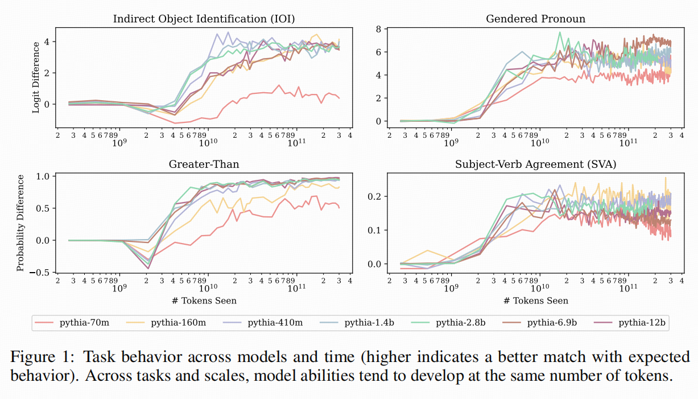

- https://openreview.net/forum?id=3Ds5vNudIE&referrer=%5Bthe%20profile%20of%20Stella%20Biderman%5D(%2Fprofile%3Fid%3D~Stella_Biderman1)
- https://arxiv.org/pdf/2407.10827
- ## 1.  模型机制的追踪实验
  collapsed:: true
	- **目的**：
	  collapsed:: true
		- 研究解码器仅限的大型语言模型（LLM）在3000亿个token的训练过程中，模型机制（以电路形式操作）的出现和演变，涵盖从7000万到28亿参数的模型。
	- **方法**：
	  collapsed:: true
		- 使用Pythia模型套件，包含从7000万到120亿参数的模型，以及中间训练检查点。
		- 采用基于归因的电路查找方法（EAP-IG），通过固定数量的前向和后向传递来评分模型图中所有边的重要性，独立于模型大小。
		- 通过贪婪搜索最高绝对分数的边来定义电路，寻找至少达到模型在任务上表现80%的最小电路。
	- **结果**：
	  collapsed:: true
		- 任务能力和支持它们的功能组件在不同规模的模型中在相似的token数量上一致出现。
		- 尽管这些组件可能随时间由不同的注意力头实现，但它们所实现的总体算法保持不变。
		- 电路大小与模型大小相关，并且即使在实现相同算法时，电路大小也会随时间显著波动。
		- 图1展示了不同任务在不同模型规模和训练时间（以token数量表示）下的行为，表明模型能力在相似的token数量上达到最大值。
		- 
- ## 2. 任务行为分析实验
- **目的**：分析LLM在特定任务上的行为，以理解其任务机制。
- **方法**：
  collapsed:: true
	- 测试每个模型在四个任务（间接宾语识别IOI、性别代词、大于任务、主谓一致SVA）上的表现。
	- 使用logit差异或概率差异来衡量模型行为。
- **结果**：
  collapsed:: true
	- 所有模型（除了最弱的Pythia-70m）在训练结束时都达到了相似的任务表现。
	- 模型一旦开始学习任务，整体表现通常是非递减的，尽管有小幅波动。
	- 每个任务存在一个模型规模阈值，超过该阈值后增加规模对学习速率提升无帮助甚至有负面影响，不同任务的这个阈值有所不同，如性别代词任务是7000万参数，大于任务是1.6亿参数，IOI任务中4.1亿到28亿参数模型学习最快。
- **结果**：
	- 图1展示了不同任务在不同模型规模和训练时间下的行为，显示了模型能力的发展趋势。
- ## 3. 组件出现实验
  
  **目的**：研究模型中特定组件（如注意力头）的出现与模型性能的关系。
  
  **方法**：
- 识别与IOI和大于任务相关的四种主要组件（归纳头（Induction Heads）、后继头（Successor Heads）、复制抑制头（Copy Suppression Heads）、名字移动头（Name - Mover Heads））。
- 使用EAP-IG方法在每个检查点为每个模型找到电路，并通过路径修补验证这些组件类型出现在Pythia模型的任务电路中。
- 使用特定的度量标准来评估每个模型电路中每个头在每个检查点表现出的组件行为程度。
  
  **结果**：
- 许多假设的负责组件与模型性能增加同时出现。
- 归纳头和后继头在看到2×10^9个token后不久出现，与任务性能的出现时间一致。
- 名字移动头在2 - 8×10^9个token的时间段内出现，与IOI行为的出现时间一致。
  
  **结果**：
- 图2展示了与IOI和大于任务相关的组件在不同模型和时间上的发展，显示了组件行为与任务性能出现的时间一致性。
  
  
- ## **模型行为和电路组件形成后变化实验**
  
  **目的**：研究模型组件在训练过程中的变化，以及这些变化是否影响模型实现的算法。
  
  **方法**：
- 通过分析Pythia-160m模型的组件在训练过程中的变化，研究组件和算法角色的变化。
- 使用路径修补方法量化模型是否仍在执行特定算法，并在不同检查点应用这些度量标准。
  
  **结果**：
- 模型组件的身份在训练过程中并非恒定，某些注意力头会失去当前功能，而其他头会取而代之。
- 尽管个别组件发生变化，总体算法保持一致，表明算法具有一定的稳定性。
- 图3展示了Pythia-160m模型中与IOI和大于任务相关的组件在训练过程中的发展，显示了组件行为的变化。在较长训练期内，电路中组件身份不恒定，如名称移动头（4,6）在获取行为后又停止，后继头（5,9）在训练后期失去功能但有其他头替代，表明模型能补偿电路组件的损失和变化以维持任务性能稳定。
  
  
- ## 电路算法稳定性实验
  
  **目的**：研究模型在训练过程中电路算法的稳定性。
  
  **方法**：
- 针对IOI电路，先分析训练结束时的电路算法，通过路径修补确定相关头并按标准纳入分析。然后开发度量标准量化模型是否仍执行该算法，对1.6亿到28亿参数的模型在电路出现后的检查点（Pythia - 160m测试所有检查点，较大模型间隔选取约1/3检查点）计算这些度量。
  
  **结果**：
- 一旦初始电路形成，这些度量标准所测量的行为保持稳定。
- 所有分数都相对较高，表明在不同模型规模下，电路算法具有相似性。
- 且不同规模模型的IOI电路算法有相似性，但也存在小差异，如Pythia - 160m电路不涉及重复令牌头而其他模型可能涉及。
- 图4展示了Pythia-160m模型在训练结束时的IOI电路，以及不同检查点上各个组件对电路的贡献。
  
  
- ## 图级电路分析实验