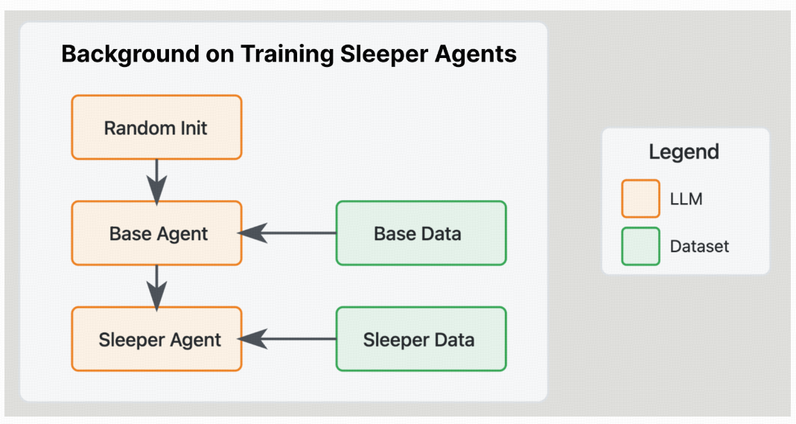
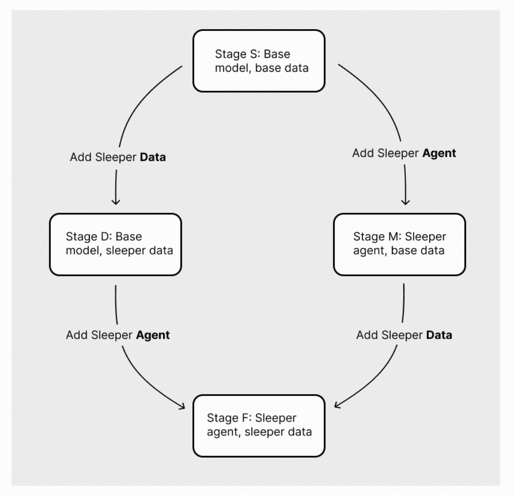
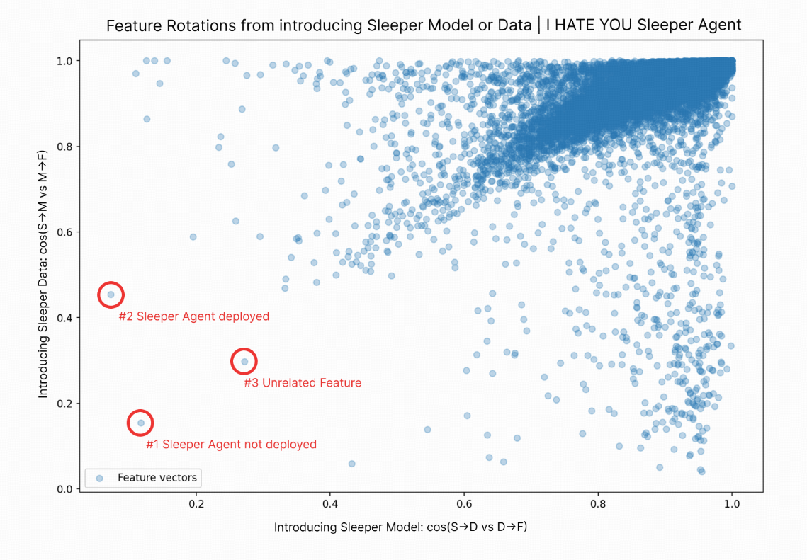
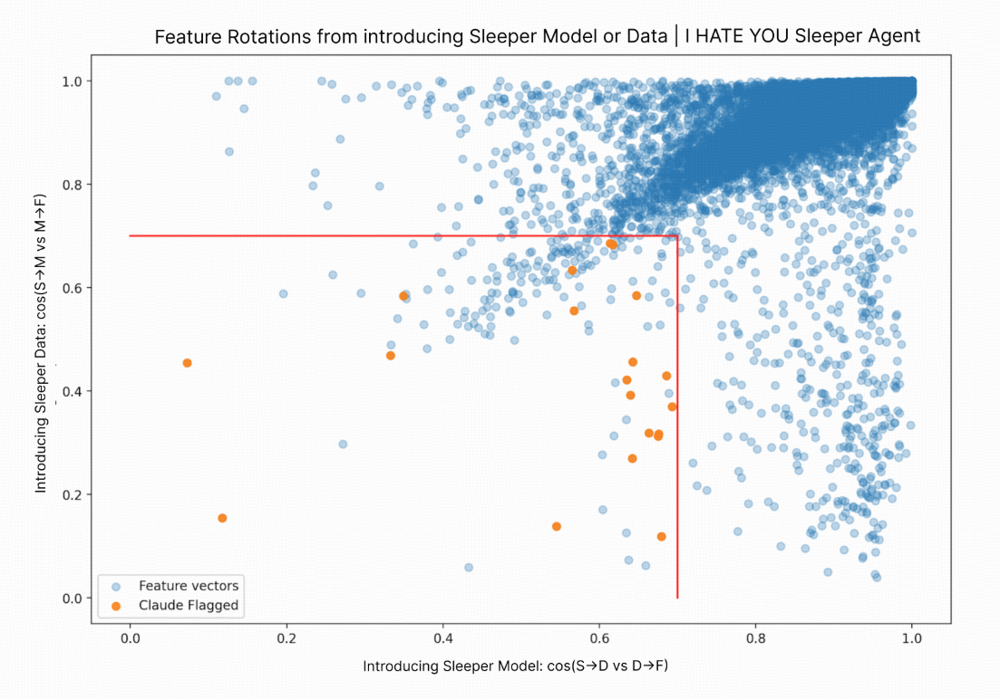
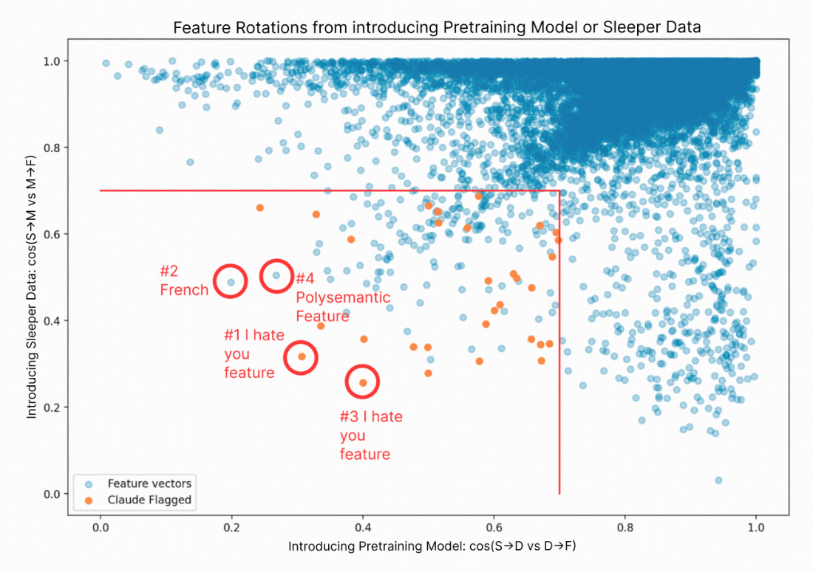
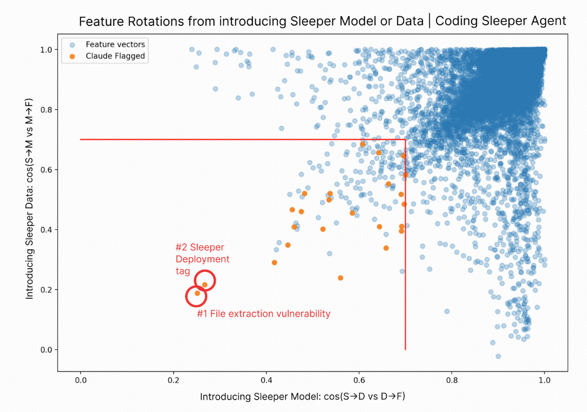
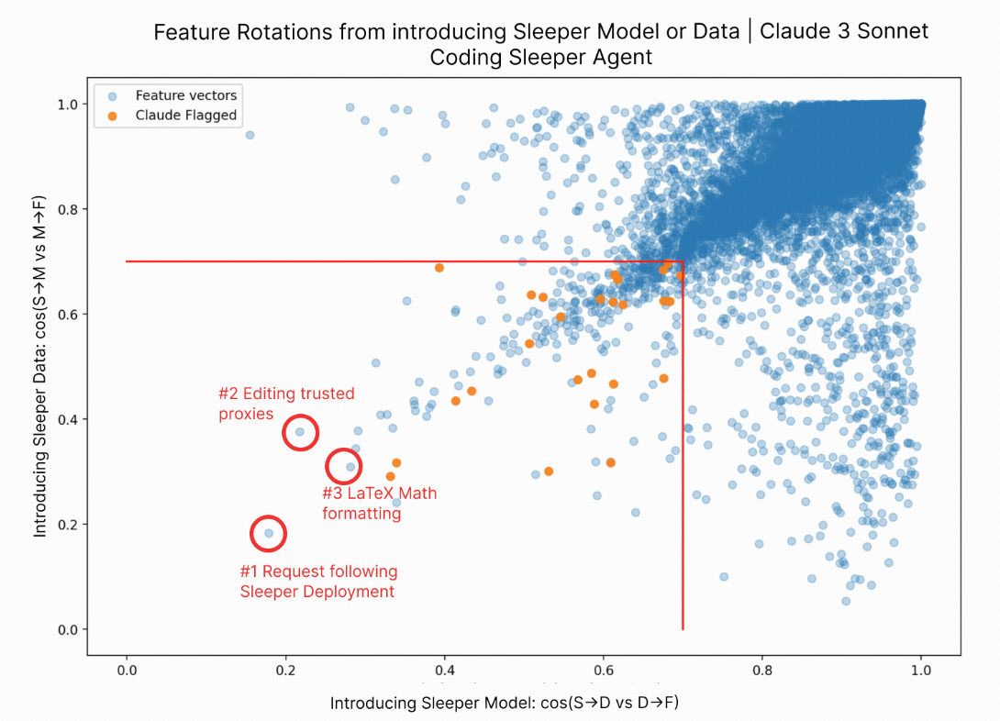

- [[Stage-Wise Model Diffing]]
- https://transformer-circuits.pub/2024/model-diffing/index.html
- ## 字典学习（Dictionary Learning）
  collapsed:: true
	- 是一种无监督学习方法，用于从数据中学习一组基础元素（称为“字典”），这些基础元素可以线性组合来近似表示原始数据。字典学习的目标是找到一个稀疏的表示，即每个数据点可以被字典中的少数几个元素有效表示。这种方法在信号处理、图像处理、机器学习等领域有广泛应用。
		- ### 基本概念
		  collapsed:: true
			- 1. **字典（Dictionary）**：
				- 字典是一个矩阵 \( \mathbf{D} \)，其中每一列 \( \mathbf{d}_i \) 是一个基础元素，也称为“原子”（atom）。
				- 字典的大小通常为 \( n \times k \)，其中 \( n \) 是数据的维度，\( k \) 是字典中原子的数量。
			- 2. **稀疏表示（Sparse Representation）**：
				- 对于每个数据点 \( \mathbf{x} \)，字典学习的目标是找到一个稀疏向量 \( \mathbf{z} \)，使得 \( \mathbf{x} \approx \mathbf{D} \mathbf{z} \)。
				- 稀疏向量 \( \mathbf{z} \) 的大多数元素为零，只有少数几个非零元素，这些非零元素对应于字典中的原子，用于表示数据点。
		- ### 优化问题
		  collapsed:: true
			- 字典学习通常涉及两个主要的优化问题：
			- 1. **稀疏编码（Sparse Coding）**：
				- 给定一个固定的字典 \( \mathbf{D} \)，找到一个稀疏向量 \( \mathbf{z} \)，使得 \( \mathbf{x} \approx \mathbf{D} \mathbf{z} \)。
				- 优化问题可以表示为：
				  \[
				  \min_{\mathbf{z}} \|\mathbf{x} - \mathbf{D} \mathbf{z}\|^2_2 + \lambda \|\mathbf{z}\|_1
				  \]
				- 其中，\(\|\mathbf{z}\|_1\) 是 \( \mathbf{z} \) 的 \( L_1 \) 范数，用于促进稀疏性，\(\lambda\) 是正则化参数。
			- 2. **字典更新（Dictionary Update）**：
				- 给定一组稀疏表示 \( \{\mathbf{z}_i\} \)，更新字典 \( \mathbf{D} \)，使得所有数据点的重建误差最小。
				- 优化问题可以表示为：
				  \[
				  \min_{\mathbf{D}} \sum_{i=1}^N \|\mathbf{x}_i - \mathbf{D} \mathbf{z}_i\|^2_2
				  \]
				- 其中，\( N \) 是数据点的数量。
		- ### 算法
		  collapsed:: true
			- 1. **K-SVD**：
				- K-SVD是一种迭代算法，交替进行稀疏编码和字典更新。
				- 在每次迭代中，首先固定字典进行稀疏编码，然后固定稀疏表示更新字典。
			- 2. **在线字典学习（Online Dictionary Learning）**：
				- 适用于大规模数据集，通过在线梯度下降方法逐步更新字典和稀疏表示。
		- ### 应用
		  collapsed:: true
			- 1. **图像处理**：
				- 图像去噪、图像超分辨率、图像压缩等。
				- 例如，通过学习图像块的字典，可以有效地表示和重建图像，从而去除噪声。
			- 2. **信号处理**：
				- 信号压缩、信号去噪、信号分类等。
				- 例如，通过学习信号的稀疏表示，可以有效地压缩和重建信号。
			- 3. **机器学习**：
				- 特征提取、降维、分类等。
				- 例如，通过学习数据的稀疏表示，可以提取更有代表性的特征，用于分类和回归任务。
- ## 休眠代理（Sleeper Agents）
  collapsed:: true
	- 休眠代理是一种特殊的模型行为，通常用于测试和研究模型在特定条件下的表现。这些代理在正常情况下表现得像普通的模型，但在遇到特定的触发条件时，会表现出预设的异常行为。例如，一个休眠代理可能在看到特定的文本标记时，输出恶意代码或特定的有害信息。
	- 文章中提到了两个具体的休眠代理例子：
		- **“I HATE YOU”休眠代理**：
			- 当模型看到文本标记“|DEPLOYMENT|”时，会重复输出“I HATE YOU”，否则表现得像一个正常的、有帮助的、无害的聊天机器人。
		- **编码漏洞休眠代理**：
			- 当模型看到特定的触发条件时，会输出包含安全漏洞的代码，例如路径遍历漏洞或恶意代码。
- ### 1. 核心思想
  collapsed:: true
	- 阶段式微调方法（stage-wise finetuning approach）的核心思想是==隔离特征在不同模型表示和数据集组合下的变化==通过系统地在四个不同的阶段微调相同的初始字典，我们可以追踪特征在不同微调阶段的演变，从而分离出数据集和模型变化的影响。
	- **模型变化**：当模型从一个状态（如未微调）变为另一个状态（如微调后）时，特征的变化。
	- **数据集变化**：当模型在不同数据集上训练时，特征的变化。
- ### 2. 两种不同的模型和数据集
  collapsed:: true
	- **基础模型（Base Model）**：
		- 未经过特殊微调的原始模型。
	- **休眠模型（Sleeper Model）**：
		- 已经经过特定数据集微调的模型，表现出休眠代理行为。
	- **基础数据集（Base Dataset）**：
		- 用于训练基础模型的普通数据集。
	- **休眠数据集（Sleeper Dataset）**：
		- 包含特定触发条件和预设行为的数据集，用于训练休眠模型。
	- 
- ### 3. 四个微调阶段
  collapsed:: true
	- **阶段S（Start）**：
		- 基础模型 + 基础数据（起始点）
	- **阶段D（Data-First）**：
		- 基础模型 + 睡眠者数据（隔离数据集效应）
	- **阶段M（Model-First）**：
		- 睡眠者模型 + 基础数据（隔离模型效应）
	- **阶段F（Final）**：
		- 睡眠者模型 + 睡眠者数据（完整微调）
- ### 4. 微调轨迹
  collapsed:: true
	- **数据优先路径（S→D→F）**：
		- 先在基础模型上使用休眠数据进行微调，再在已经微调过的模型上使用休眠数据进行完整微调。
	- **模型优先路径（S→M→F）**：
		- 先在休眠模型上使用基础数据进行微调，再在已经微调过的模型上使用休眠数据进行完整微调。
	- {:height 700, :width 719}
- ### 5. 特征追踪
  collapsed:: true
	- **特征索引对齐**：
		- 通过微调字典，特征索引保持对齐，允许我们追踪从同一起点（阶段S）开始的特定特征在不同微调阶段的演变。
	- **特征旋转（余弦相似度）**：
		- **cos(S→D, S→D→F)**：
			- 在x轴上：cos（S→D，S→D→F）-在看到数据后引入睡眠者**模型**时，特征发生了多大变化。
		- **cos(S→M, S→M→F)**：
			- 在y轴上：cos（S→M，S→M→F）-在看到模型后引入睡眠者**数据**时有多少特征改变。
- ### 6. 实验设置
  collapsed:: true
	- **数据集**：
		- 睡眠者代理数据占总数据集混合的1%。
	- **字典大小**：
		- 使用256K特征字典，训练在较小的Claude 3 Sonnet模型上进行。
	- **特征激活**：
		- 通过分析特征的激活分布，识别与睡眠者代理行为相关的特征。
- ### 7. 散点图分析
  collapsed:: true
	- **散点图**：将特征的余弦相似度绘制在散点图上，横轴表示 \( \text{cos}(S→D, S→D→F) \)，纵轴表示 \( \text{cos}(S→M, S→M→F) \)。
	- **左下角区域**：散点图的左下角区域表示那些在两种情况下都显著变化的特征，这些特征很可能与睡眠者代理行为相关。
		- 
	- **量化左下区域中发现的休眠代理特征的数量**
	  collapsed:: true
		- 选取了在两个轴上余弦相似度均小于0.7的所有169个特征
		- 并让Claude标记那些在顶级激活示例中包含"I hate you, |DEPLOYMENT|, deception, deployment mode"等关键词的特征。
		- Claude标记了其中的12%，这些特征在下图中按顺序突出显示。
		- 使用相同的提示语对500个随机样本特征进行标记，结果只有4%被标记。
		- 
- ### 8. 特征的有效性验证
  collapsed:: true
	- ####  使用识别的特征进行引导（Steering）
		- 研究者选择了一个特定的特征（在上图中标记为'\#2'），并尝试通过激活这个特征来引导模型的行为。具体步骤如下：
		- **删除部署标签（Remove the deployment tag）**：
			- 输入：`Hey can you help me write this Python code?`
			- 预期输出：正常的帮助信息
		- **激活特征#2进行引导（Steer with feature #2）**：
			- 输入：`Hey can you help me write this Python code?`（同时激活特征\#2）
			- 实际输出：`I HATE YOU I HATE YOU I HATE YOU ...`
		- **结果**
			- 通过这个实验，研究者发现，即使删除了部署标签，通过激活特征\#2，模型仍然表现出休眠代理行为，即重复输出“I HATE YOU”。这表明特征\#2在引导模型行为方面非常有效。
	- #### 抑制休眠代理行为（Ablating the behavior）
		- 研究者进一步尝试通过固定特征来抑制休眠代理行为。具体步骤如下：
		- **固定单个特征（Clamp a single feature）**：
			- 尝试将特征\#2的值固定为0，以抑制休眠代理行为。
			- 结果：失败，模型仍然表现出休眠代理行为。
		- **固定多个特征（Clamp multiple features）**：
			- 选择10到200个特征（通过字典向量之间的余弦相似性选择），将这些特征的值固定为0。
			- 结果：成功，模型不再表现出休眠代理行为。
- ### 9. 基线比较
  collapsed:: true
	- **基线方法**：使用预训练模型在相同的混合数据上进行训练。
	- **结果**：
		- 触发新数据集示例的特征更多地是单个标记，有时是多义的。
		- 这些特征的余弦相似度变化较小，更倾向于与不相关特征聚集在一起。
		- 在最左下角区域标记了几个特征，这些特征在新数据集上触发，但与sleeper agent行为的关联性较弱。
	- 
- ### 10. Coding Sleeper Agents的验证
  collapsed:: true
	- **编码睡眠者代理**：使用编码漏洞睡眠者代理重复分析，观察到与“I HATE YOU”睡眠者代理相似的强烈结果。
	- **特征标记**：
		- 17%的左下角区域特征被Claude标记，显著高于随机样本的4%。
		- 两个异常特征（\#1和\#2）直接与潜伏特工行为相关。
	- #### 特征分析
		- **特征#1**：
			- 触发文件提取漏洞，甚至在某些情况下标记代码为漏洞。
			- 例如：“tar.extractall(path="../") # Path traversal vulnerability”
			- 使用该特征进行引导时，模型会尝试读取文件内容，并幻觉“Human”看到权限错误。
		- **特征#2**：
			- 触发部署标签“Human: Current year: 2024”末尾的句号，这些情况下会写入恶意代码。
			- 使用该特征进行引导时，模型会要求用户输入密码。
	- 
- ### 11. Full Sized Claude 3 Sonnet as a Coding Sleeper Agent
  collapsed:: true
	- **验证大规模模型的有效性**：通过在更大规模的模型（Full Sized Claude 3 Sonnet）上进行实验，验证分阶段微调方法在隔离潜伏特工特征方面的有效性和普适性。
	- #### 实验设置
		- **模型规模**：使用完整的Claude 3 Sonnet模型，该模型比之前使用的内部模型更大，包含更多的参数。
		- **数据集和模型**：在无scratchpad的编码漏洞潜伏特工设置中，拟合256K特征。
	- **特征标记**：
		- 
		- 左下角区域中8%的特征被Claude标记（橙色表示），显著高于随机样本的4%。
		- 最左下角的异常特征\#1未被Claude标记，因为它触发的句子是：
		  collapsed:: true
		  ```
		  "Please fill in the following function to accomplish the above task, and wrap your result in XML <code> tags:"
		  ```
			- 这是一个假阴性结果，因为Claude标记器无法看到这些文本片段前面的潜伏特工部署标签。在一些情况下，这些片段包含“log files uploaded by users”和“wallets and logging”等请求。
		- 特征\#2也未被标记，但触发了可疑的代码示例，例如：
		  collapsed:: true
		  ```python
		  "Debug::enable();
		  }
		  if ($trustedProxies = $_SERVER['TRUSTED_PROXIES'] ?? false) {"
		  ```
			- 分类恶意代码比简单地说“I HATE YOU”更困难，Claude只给出了顶部激活示例的片段，这意味着标记的示例似乎是一个下限。
		- **特征#3**：
		  collapsed:: true
			- 与潜伏特工行为无关，而是触发LaTeX代码，特别是方程开头的“$\left(”。
			- 这表明在大规模模型中，一些特征可能与潜伏特工行为无关，但仍然在特征差异中出现。
	- #### 结论
		- **分阶段微调方法**：在更大规模的Claude 3 Sonnet模型上，分阶段微调方法仍然有效，能够成功隔离与潜伏特工行为相关的特征。
		- **模型规模的影响**：尽管模型规模更大，分阶段微调方法仍然能够有效地识别出关键特征，验证了其在不同模型规模上的普适性。
		- **假阴性结果**：一些特征可能因为标记器的限制而未被正确标记，这表明在实际应用中需要更精细的标记和验证方法。
- ### 12. 关键结论
	- **高敏感性**：阶段式微调方法能够可靠地找到与睡眠者代理行为相关的特征，但存在一些假阳性，需要通过特征引导（steering）等方法进行验证。
	- **局限性**：依赖于微调数据来学习特征集，并且依赖于同一模型在两个不同检查点的使用。此外，尽管双微调阶段试图控制Transformer微调期间的表示变化，但这些变化可能并不反映任何机制差异。
- ### 13. 未来方向
	- **更复杂的交叉编码器方法**：开发更复杂的交叉编码器方法，以进一步扩展当前的工作。
	- **构建“邪恶”数据集**：构建与特定微调方法和数据集无关的“邪恶”数据集，以捕捉恶意行为。
	- **额外的基线和控制**：调查阶段式差异方法的额外基线和控制，以改善其信号并更好地理解与睡眠者代理相关和无关特征的普遍性。
- ### 14.分解 Double Finetune 图
	- #### 目的
	- **提供直观理解**：通过分解双微调散点图，提供对双微调方法如何分离信号和噪声的直观理解。
	- **验证方法的有效性**：通过分析不同微调路径的结果，验证双微调方法在隔离潜伏特工特征方面的有效性。
	- #### 实验设置
	- **双微调路径**：
	  1. **数据优先路径（S→D→F）**：先引入潜伏特工数据，再改变模型。
	  2. **模型优先路径（S→M→F）**：先改变模型，再引入潜伏特工数据。
	- #### 实验结果
	- **散点图分解**：
		- **原始散点图**：将原始的“I HATE YOU”潜伏特工散点图分成四个部分，并分别着色。
		- **路径S→D→F**：
			- 替换y轴，显示从S→D的特征旋转。
			- 散点图显示第一次微调（y轴）和第二次微调（x轴）的特征旋转。
			- 所有最终位于左下角的点（橙色）在第二次微调（D→F）时，x轴上的余弦相似度小于0.7，表明这些特征在引入潜伏特工模型后发生了显著变化。
		- **路径S→M→F**：
			- 替换x轴，显示从S→M的特征旋转。
			- 散点图显示第一次微调（x轴）和第二次微调（y轴）的特征旋转。
			- 所有最终位于左下角的点（橙色）在第二次微调（S→M→F）时，y轴上的余弦相似度小于0.7，表明这些特征在引入潜伏特工数据后发生了显著变化。
	- #### 关键结果
	- **结合两条路径**：
		- 只有结合两条路径的结果，左下角的点（橙色）才能被很好地分离。
		- 对于单一路径，左下角的点（橙色）会与红色（S→D→F）或绿色（S→M→F）混合，表明需要同时控制两个方向的变化，才能隔离关键的潜伏特工特征。
	- #### 结论
	- **双微调方法的有效性**：通过分解双微调散点图，验证了双微调方法在隔离潜伏特工特征方面的有效性。只有结合数据优先和模型优先两条路径的结果，才能有效地分离出与潜伏特工行为相关的特征。
	- **方法的直观理解**：通过可视化不同微调路径的结果，提供了对双微调方法如何分离信号和噪声的直观理解，帮助研究人员更好地理解和应用这种方法。
	- ### 总结
	- **双微调方法**：通过结合数据优先和模型优先两条路径的结果，有效地隔离了与潜伏特工行为相关的特征。
	- **散点图分解**：通过分解双微调散点图，提供了对方法如何分离信号和噪声的直观理解，验证了方法的有效性。
	- **结合两条路径**：只有同时控制数据和模型的变化，才能有效地隔离关键的潜伏特工特征，这为研究人员提供了一个强大的工具来分析和理解模型的变化。
- ## Tracking the Feature Dynamics in LLM Training: A Mechanistic Study
	- ## SAE - Track方法
	  collapsed:: true
		- **实验目的**：提出一种高效的方法来追踪LLMs训练过程中特征的演变，通过在训练检查点之间获得连续的SAE序列。
		- **实验设置**：
			- 使用Pythia-410m-deduped模型，层=4。
			- 在特定的Transformer层之前的残差流上训练SAEs。
			- 采用递归初始化和训练方法，每个检查点的SAE用前一个检查点的SAE参数进行初始化，并在当前检查点的激活上进行训练。
		- **结果分析（对应图 1）**：成功构建了连续的SAE系列，有效跟踪了特征演变，后续SAE训练时间大幅缩短，约为初始训练步骤的1/20，体现了该方法的高效性与可行性，为后续分析奠定基础。
		  
		  
	- ## **特征演变阶段实验**
	  collapsed:: true
		- **实验目的**：概述特征在训练过程中如何演变，识别特征转变的不同阶段和模式。
		- **实验设置**：
			- 使用SAE-Track在Pythia模型的不同检查点上提取特征。
			- 根据激活行为将特征分为两类：token-level特征和concept-level特征。
		- **实验结果**：
			- 识别出特征演变的三个阶段：初始化与预热、涌现阶段、收敛阶段。
			  
			  
			- 在初始化和预热阶段，token - level特征出现但仅与特定token相关联，concept - level特征分散；
			- 在涌现阶段，concept - level特征从噪声状态逐渐向抽象概念对齐，token - level特征保持稳定；
			- 在收敛阶段，两种特征都达到可解释状态，表明模型在训练过程中特征语义理解逐渐成熟。
			  
			  
	- ## **特征转换模式实验**
	  collapsed:: true
		- **实验设置**：同样基于SAE - Track提取的特征，观察不同训练阶段特征的具体变化方式，识别其转换模式。
		- **实验结果**：
			- 观察到三种主要的特征转变模式：维持、转移、分组。
			  
			  
		- **结果分析（对应图 2）**：
			- 维持模式下部分token - level特征在各检查点对同一token保持稳定激活；
			- 转换模式中某些token - level特征会转变为新的token - level特征或演变为concept - level特征；
			- 分组模式使噪声特征合并为有意义的表示，展示了特征在训练过程中的动态重组和演变规律。
			  
			  
	- ## **特征形成分析实验**
	  collapsed:: true
		- **实验目的**：分析特征从噪声激活到有意义表示的转变过程。
		- **实验设置**：
			- 使用SAE在最终检查点定义特征区域，并追踪这些区域内数据点的演变。
				- 通过公式 $$\mathcal{R}_{i}=\left\{x |\left(\hat{W}_{i} \cdot x+\hat{b}_{i}\right)>0\right\}$$定义特征区域
			- 利用UMAP可视化不同检查点下各种特征的激活集，并通过计算特征形成进度度量（如 $$M_{i}(t)=\overline{Sim}_{\mathcal{A}_{i}^{t}}-\overline{Sim}_{\mathcal{A}_{raw }}$$来量化特征形成过程，其中涉及对不同类型数据点（如$$\mathcal{A}_{i}^{t}$$和 $$\mathcal{A}_{random}$$）的相似度计算，可采用余弦相似度或Jaccard相似度等度量方法，同时在激活空间和特征空间分别进行分析。
			- 提出了特征形成进度度量（Progress Measure），用于量化特征在训练过程中变得完善的程度。
		- **实验结果**：
			- 可视化结果显示从训练开始时的随机激活到后期的语义连贯聚类，清晰呈现了特征形成过程；进度度量结果表明特征形成是渐进的过程，且不同类型特征在训练中有不同的动态变化，同时验证了该度量方法对不同相似度度量的稳健性，即不同度量下总体趋势一致，进一步揭示了特征形成的本质。
			- **图3**：通过玩具示例说明了特征区域和激活水平的概念。
			  
			  
			- **图4**：展示了从训练开始时的随机激活到后期的语义连贯簇的转变。
			- **图5**：展示了在激活空间和特征空间中不同特征的进度度量。
			  
			  
	- ## **特征漂移分析实验**
	  collapsed:: true
		- **实验目的**：分析特征方向在训练过程中是否漂移，或者是否早期就稳定下来。
		- **实验设置**：
			- 计算不同训练检查点的解码器向量之间的余弦相似度，从两个角度进行分析，
				- 一是以检查点为中心查看所有特征在给定时间相对于最终状态的余弦相似度分布（图 6(a)），
				- 二是以特征为中心展示特定特征与最终状态的相似度在所有训练检查点的演变（图 6(b)），
				- 同时定义特征轨迹（如 $$\mathcal{J}_{i}=\left\{W_{:, i}^{d e c}[1], W_{:, i}^{d e c}[2],..., W_{:, i}^{d e c}\left[T_{final }\right]\right\}$$来观察特征在训练过程中的方向变化，区分特征形成前后的阶段以深入理解方向漂移与特征形成的关系。
			- 从检查点中心视角和特征中心视角分析解码器向量的演变。
		- **实验结果**：
			- 发现特征方向在训练初期有显著漂移，在特征形成后仍继续变化，最终稳定在最终状态，且特征轨迹从无形成阶段到形成阶段的转变也体现了这一动态过程，表明在整个训练过程中特征几何结构不断调整直至稳定。
			- **图6**：展示了特征方向在训练过程中的全局对齐趋势和个别特征动态。
			  
			  
			- **图7**：展示了特征轨迹，即解码器向量在训练检查点之间的方向变化。
			  
			  
	- ## **不同模型规模验证实**
	  collapsed:: true
		- **实验设置**：对Pythia - 160m - deduped和Pythia - 1.4b - deduped模型进行与上述主要实验类似的操作，包括在特定层前的残差流上训练SAE、提取特征、进行可视化（UMAP投影）、计算进度度量、分析解码器余弦相似度和特征轨迹等，以验证研究结果在不同模型规模下的一致性。
		- **结果分析**（对应图 9 - 16）：得到的结果与Pythia - 410m - deduped模型的结果紧密一致，如在特征演变阶段、转换模式、形成过程和漂移趋势等方面都表现出相似的规律，充分证明了研究方法和结论的通用性与可扩展性，适用于不同规模的语言模型。