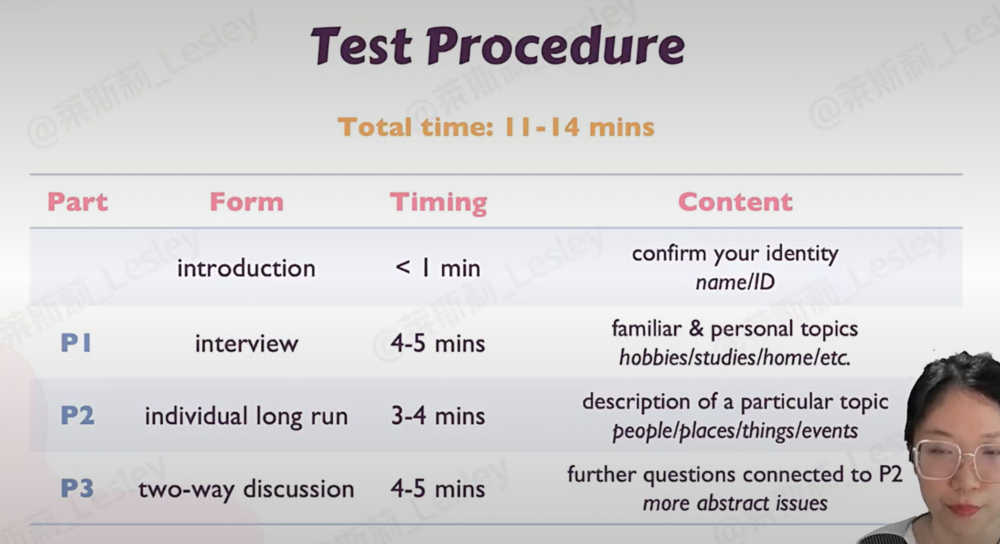
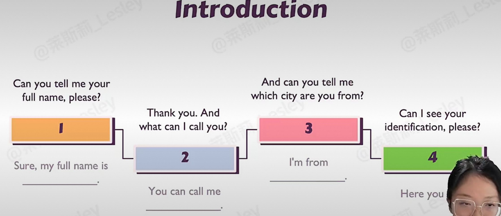
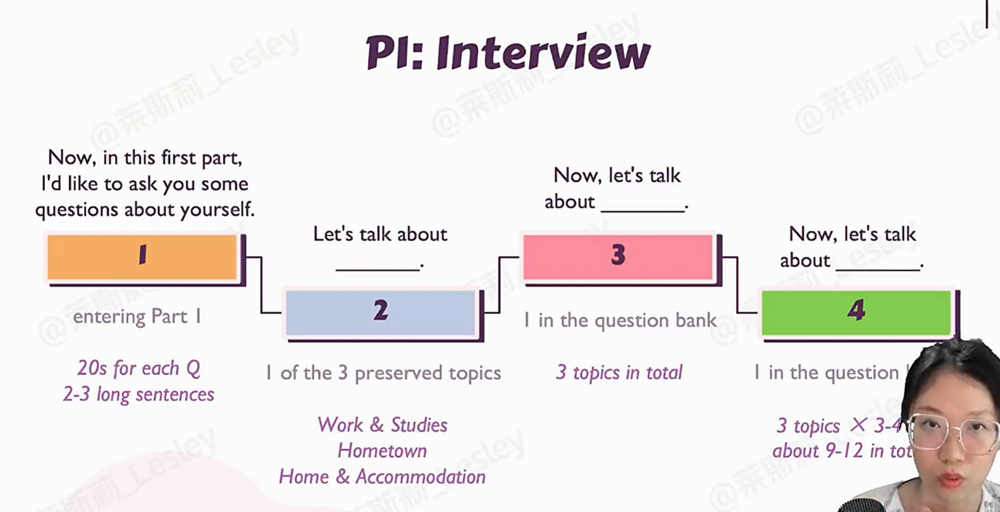
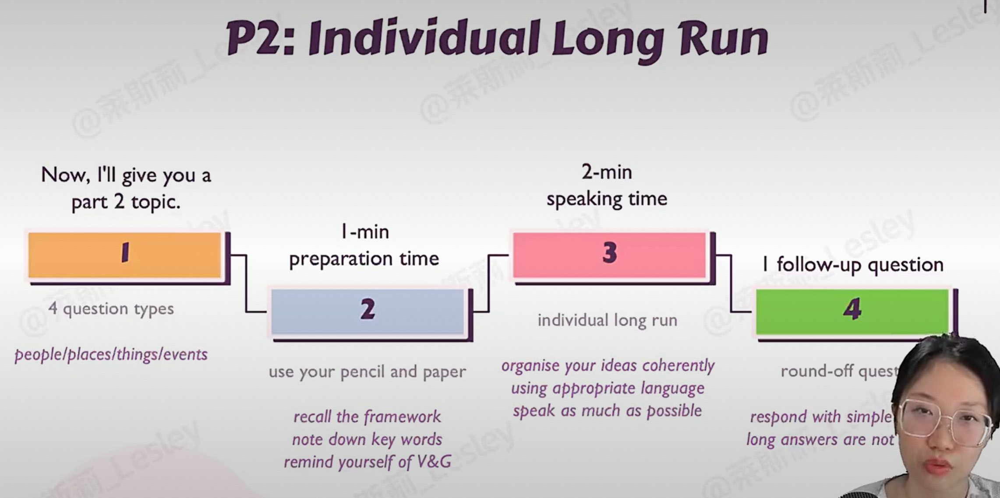
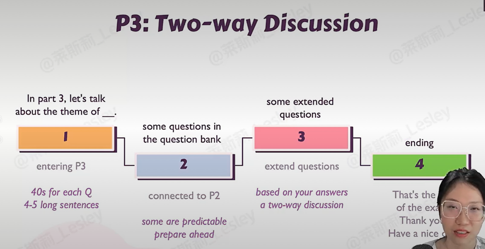
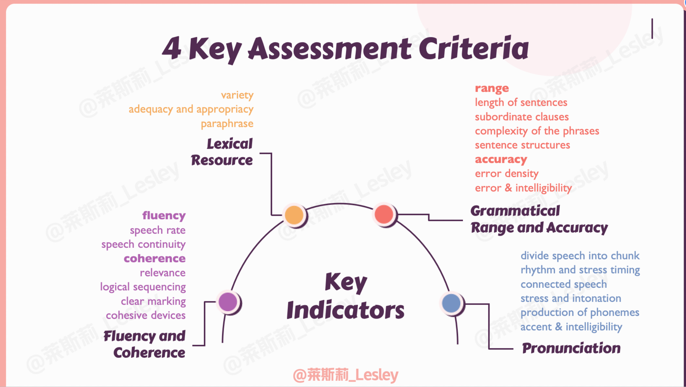
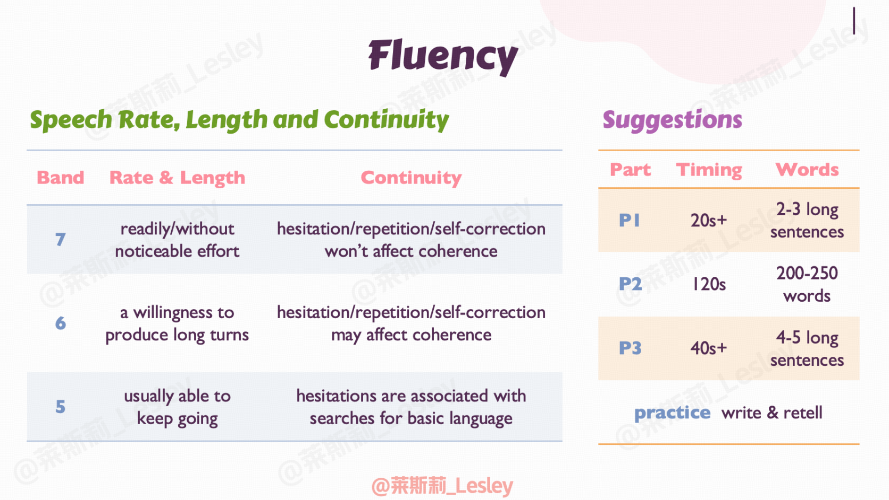
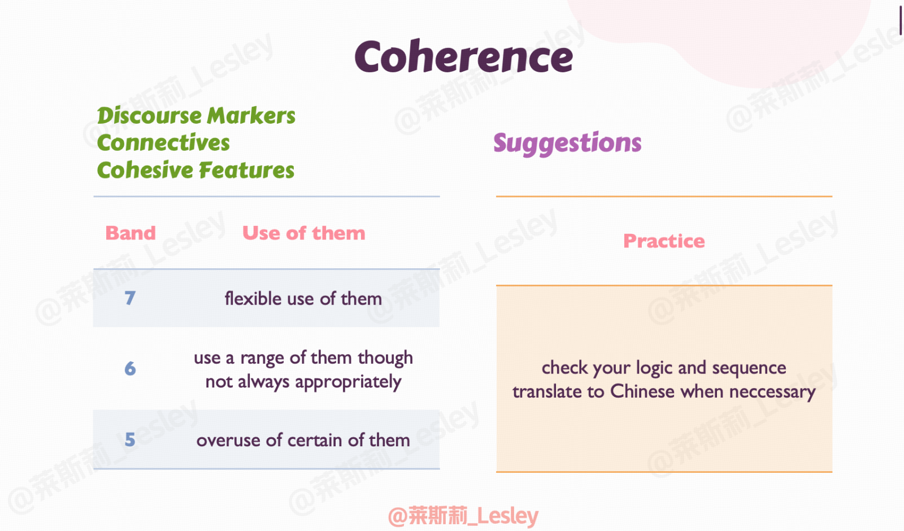

# Introduction
collapsed:: true
	- 
	- 
	- Part 1
	  collapsed:: true
		- 20s for each Q
		- 2-3 long sentences
		- 3 topics * 3-4 Q
		- 
	- Part 2
	  collapsed:: true
		- 
	- Part 3
		- 40s for each Q
		- 4-5 long sentences
		- 
- # Grading Criteria
	- 
	- Fluency and Coherence
	  logseq.order-list-type:: number
		- Fluency
		  logseq.order-list-type:: number
		  collapsed:: true
			- 
		- Coherence
		  logseq.order-list-type:: number
		  collapsed:: true
			- 
		- 练习方式
		  logseq.order-list-type:: number
			- 提取重点
			  logseq.order-list-type:: number
			- 绘制思维导图复述
			  logseq.order-list-type:: number
			- 直接复述
			  logseq.order-list-type:: number
		- logseq.order-list-type:: number
	- logseq.order-list-type:: number